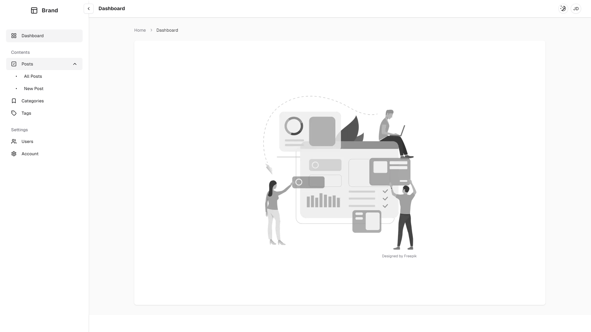
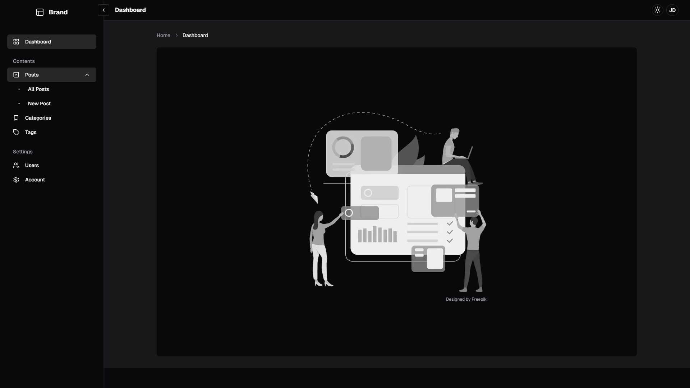
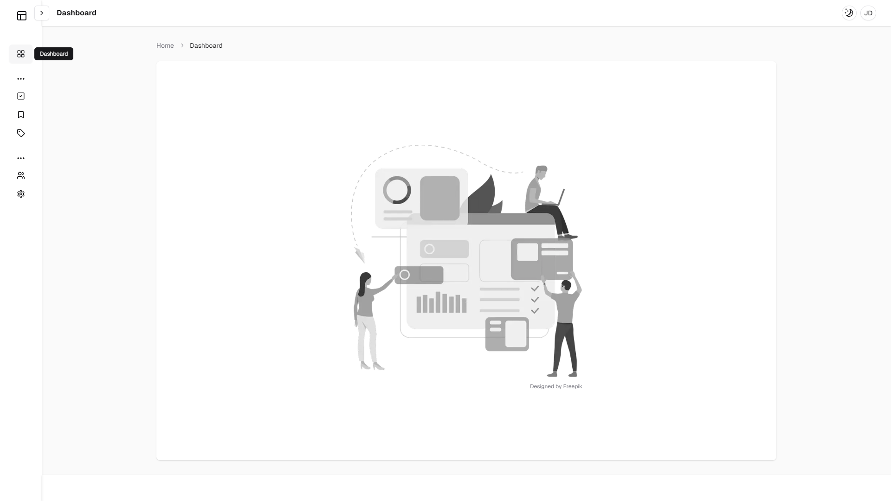
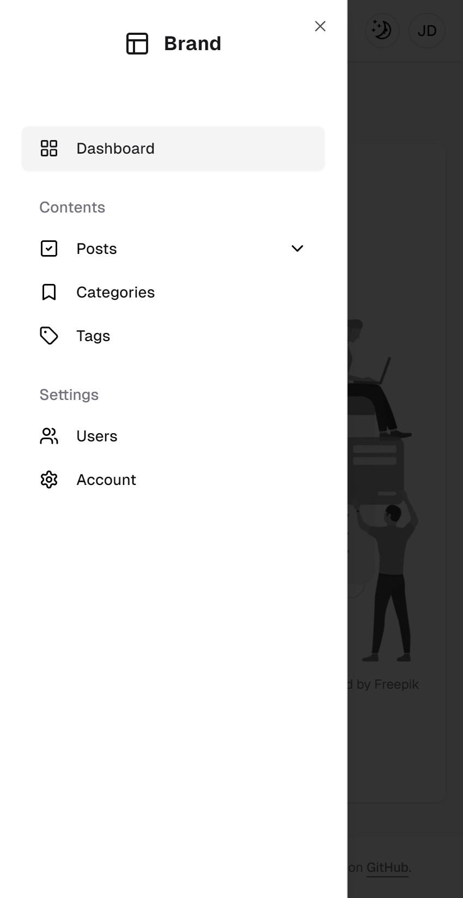

# Admin Boilerplate

A modern, production-ready admin dashboard boilerplate built with Next.js, React, shadcn/ui, and Tailwind CSS.

## Tech Stack

- ⚡ **Next.js 15** - Latest version with App Router and enhanced performance
- ⚛️ **React 19** - Cutting-edge React with improved Server Components
- 🎨 **shadcn/ui** - Latest version of the beautiful, accessible component library
- 🎭 **Tailwind CSS 4** - Latest utility-first CSS framework
- 📊 **TanStack Table** - Powerful data table library for complex tables
- ✅ **Zod** - TypeScript-first schema validation for forms

## Features

- 📱 **Responsive Design** - Mobile-first approach
- 🌓 **Dark Mode** - Built-in theme switching
- 📊 **Dashboard Components** - Charts, tables, and data visualization
- 🧩 **Modular Architecture** - Easy to extend and customize
- 📝 **TypeScript** - Full type safety (optional)
- 🚀 **Performance Optimized** - Fast page loads and optimal rendering
- 📋 **Advanced Data Tables** - Built with TanStack Table for sorting, filtering, and pagination
- ✅ **Form Validation** - Type-safe form handling with Zod and React Hook Form

## Getting Started

### Prerequisites

- Node.js 20.0 or later (required for Next.js 15)
- npm, yarn, or pnpm

### Installation

1. Clone the repository:

```bash
git clone https://github.com/yourusername/admin-boilerplate.git
cd admin-boilerplate
```

2. Install dependencies:

```bash
npm install
# or
yarn install
# or
pnpm install
```

3. Run the development server:

```bash
npm run dev
# or
yarn dev
# or
pnpm dev
```

4. Open [http://localhost:3000](http://localhost:3000) in your browser.

## Project Structure

```
├── app/                    # Next.js app directory
│   ├── (pages)/       # Dashboard routes
│   └── layout.tsx         # Root layout
├── components/            # React components
│   ├── ui/               # shadcn/ui components
│   ├── dashboard/        # Dashboard-specific components
│   └── shared/           # Shared components
├── lib/                  # Utility functions
├── public/               # Static assets
```

## Available Scripts

- `npm run dev` - Start development server
- `npm run build` - Build for production
- `npm run start` - Start production server
- `npm run lint` - Run ESLint
- `npm run format` - Format code with Prettier

## Configuration

### Environment Variables

Create a `.env.local` file in the root directory:

```env
# App
NEXT_PUBLIC_APP_URL=http://localhost:3000

# Database
DATABASE_URL=

# Authentication (example with NextAuth)
NEXTAUTH_SECRET=
NEXTAUTH_URL=http://localhost:3000
```

### Tailwind CSS

Customize your theme in `tailwind.config.js`:

```js
module.exports = {
  theme: {
    extend: {
      colors: {
        // Add your custom colors
      },
    },
  },
};
```

### shadcn/ui

Add new components using the CLI:

```bash
npx shadcn-ui@latest add button
npx shadcn-ui@latest add card
npx shadcn-ui@latest add data-table
```

### Forms with Zod

Example form validation:

```typescript
import { z } from "zod";
import { useForm } from "react-hook-form";
import { zodResolver } from "@hookform/resolvers/zod";

const formSchema = z.object({
  username: z.string().min(2).max(50),
  email: z.string().email(),
});

const form = useForm<z.infer<typeof formSchema>>({
  resolver: zodResolver(formSchema),
});
```

### Data Tables with TanStack Table

Create powerful, feature-rich data tables with sorting, filtering, and pagination out of the box.

## Key Components

### Dashboard Layout

- Responsive sidebar navigation
- Header with user menu
- Breadcrumb navigation
- Main content area

### Pre-built Pages

- Dashboard overview
- Data tables
- Campaigns
- Influencers
- Login
- Signup

### UI Components

- Forms with validation (Zod + React Hook Form)
- Data tables with sorting/filtering (TanStack Table)
- Modal dialogs
- Toast notifications
- Loading states
- Error boundaries

## Customization

### Adding New Pages

1. Create a new route in the `app/(pages)` directory
2. Add the corresponding component
3. Update navigation in `lib/menu-list.tsx`

### Styling

This boilerplate uses Tailwind CSS for styling. Customize the design system in:

- `tailwind.config.js` - Theme configuration
- `app/globals.css` - Global styles and CSS variables

## Acknowledgments

- [Next.js](https://nextjs.org/)
- [React](https://react.dev/)
- [shadcn/ui](https://ui.shadcn.com/)
- [Tailwind CSS](https://tailwindcss.com/)
- [Radix UI](https://www.radix-ui.com/)
- [TanStack Table](https://tanstack.com/table)
- [Zod](https://zod.dev/)
- [React Hook Form](https://react-hook-form.com/)

## Screenshots






Built with ❤️ using Next.js and shadcn/ui
